# Test: Minimal Mermaid Flowchart

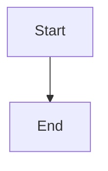

# Test: Minimal Mermaid Class Diagram

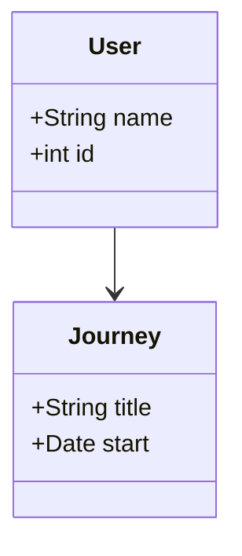

<!--
If these diagrams render but sequenceDiagram does not, your renderer or extension may not support Mermaid sequence diagrams.
Try updating your Markdown preview extension or test in the Mermaid Live Editor: https://mermaid-js.github.io/mermaid-live-editor/
-->

# Test: Minimal Mermaid Sequence Diagram (Official Example)

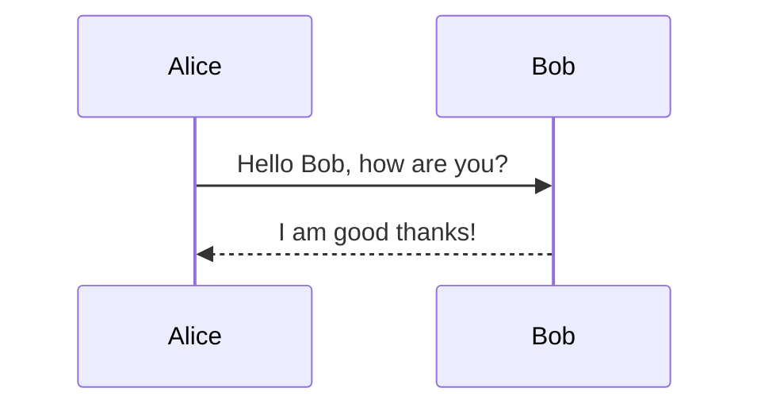

<!--
Troubleshooting Mermaid rendering:
- If this diagram does not render, the issue is with the Markdown renderer or Mermaid integration.
- Test your diagrams in the official Mermaid Live Editor: https://mermaid-js.github.io/mermaid-live-editor/
- If the official example works in the Live Editor but not here, check your Markdown viewer or VS Code extension settings.
-->

# Journey Planner - Diagram Bazy Danych

## Entity Relationship Diagram (ERD)

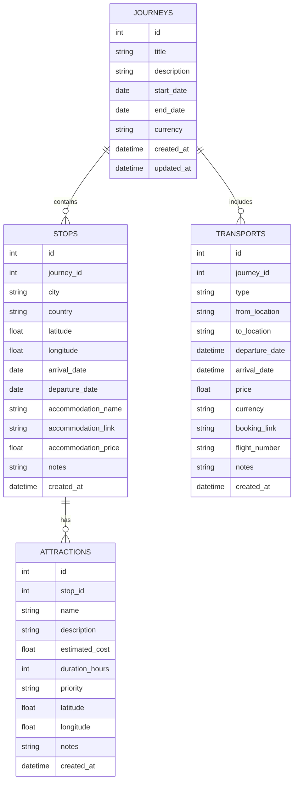

## Relacje

- **JOURNEYS → STOPS**: Jedna podróż może mieć wiele przystanków (1:N)
- **JOURNEYS → TRANSPORTS**: Jedna podróż może mieć wiele środków transportu (1:N)
- **STOPS → ATTRACTIONS**: Jeden przystanek może mieć wiele atrakcji (1:N)

## Kaskadowe Usuwanie

- Usunięcie podróży (`JOURNEYS`) automatycznie usuwa wszystkie powiązane przystanki (`STOPS`) i transporty (`TRANSPORTS`)
- Usunięcie przystanku (`STOPS`) automatycznie usuwa wszystkie powiązane atrakcje (`ATTRACTIONS`)

## Indeksy

```sql
-- Indeksy dla wydajności zapytań
CREATE INDEX idx_stops_journey_id ON stops(journey_id);
CREATE INDEX idx_transports_journey_id ON transports(journey_id);
CREATE INDEX idx_attractions_stop_id ON attractions(stop_id);
CREATE INDEX idx_journeys_dates ON journeys(start_date, end_date);
```

## Diagram Przepływu Danych

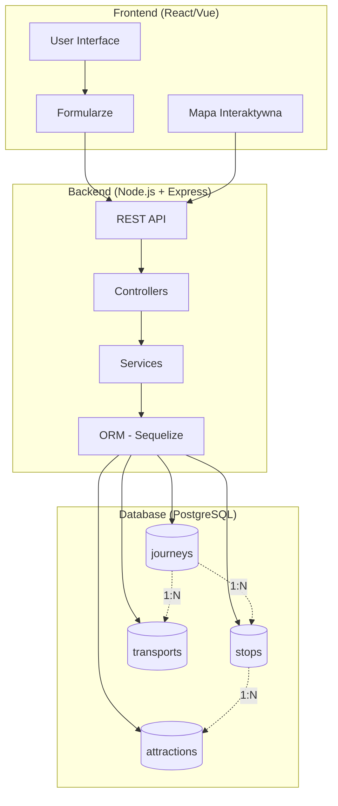

## Przykładowe Zapytania SQL

### Pobranie podróży ze wszystkimi szczegółami

```sql
-- Podróż z przystankami
SELECT 
    j.*,
    json_agg(
        json_build_object(
            'id', s.id,
            'city', s.city,
            'country', s.country,
            'arrival_date', s.arrival_date,
            'departure_date', s.departure_date
        )
    ) as stops
FROM journeys j
LEFT JOIN stops s ON j.id = s.journey_id
WHERE j.id = 1
GROUP BY j.id;
```

### Kalkulacja całkowitego kosztu podróży

```sql
-- Suma wszystkich kosztów dla podróży
SELECT 
    j.id,
    j.title,
    COALESCE(SUM(s.accommodation_price), 0) as accommodation_total,
    COALESCE(SUM(t.price), 0) as transport_total,
    COALESCE(SUM(a.estimated_cost), 0) as attractions_total,
    (
        COALESCE(SUM(s.accommodation_price), 0) +
        COALESCE(SUM(t.price), 0) +
        COALESCE(SUM(a.estimated_cost), 0)
    ) as total_cost
FROM journeys j
LEFT JOIN stops s ON j.id = s.journey_id
LEFT JOIN transports t ON j.id = t.journey_id
LEFT JOIN attractions a ON s.id = a.stop_id
WHERE j.id = 1
GROUP BY j.id, j.title;
```

### Wszystkie atrakcje w danym mieście

```sql
-- Atrakcje dla konkretnego przystanku
SELECT 
    a.*,
    s.city,
    s.country
FROM attractions a
JOIN stops s ON a.stop_id = s.id
WHERE s.id = 1
ORDER BY 
    CASE a.priority
        WHEN 'high' THEN 1
        WHEN 'medium' THEN 2
        WHEN 'low' THEN 3
    END;
```

## Diagram Architektury Systemu

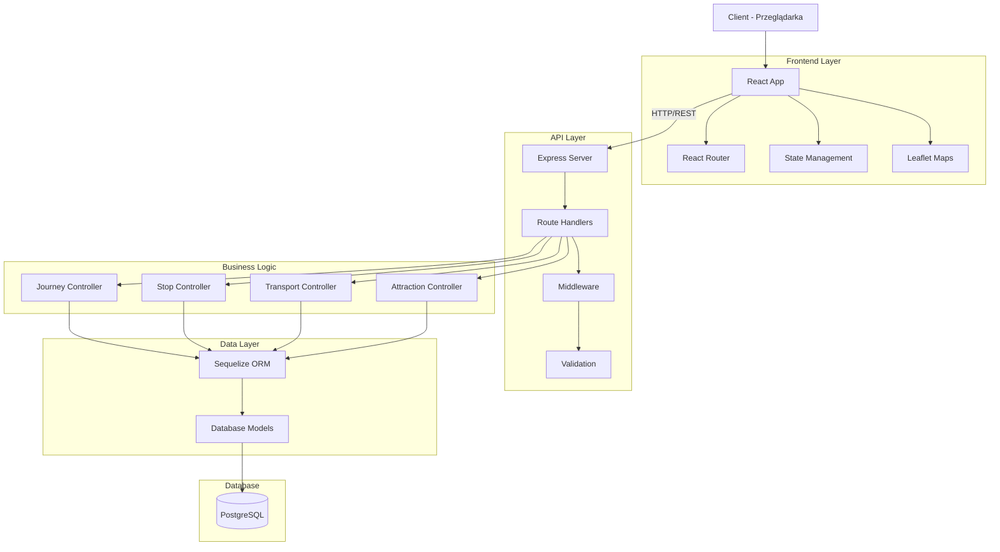

## Scenariusze Użycia - Diagram Sekwencji

### Tworzenie Nowej Podróży

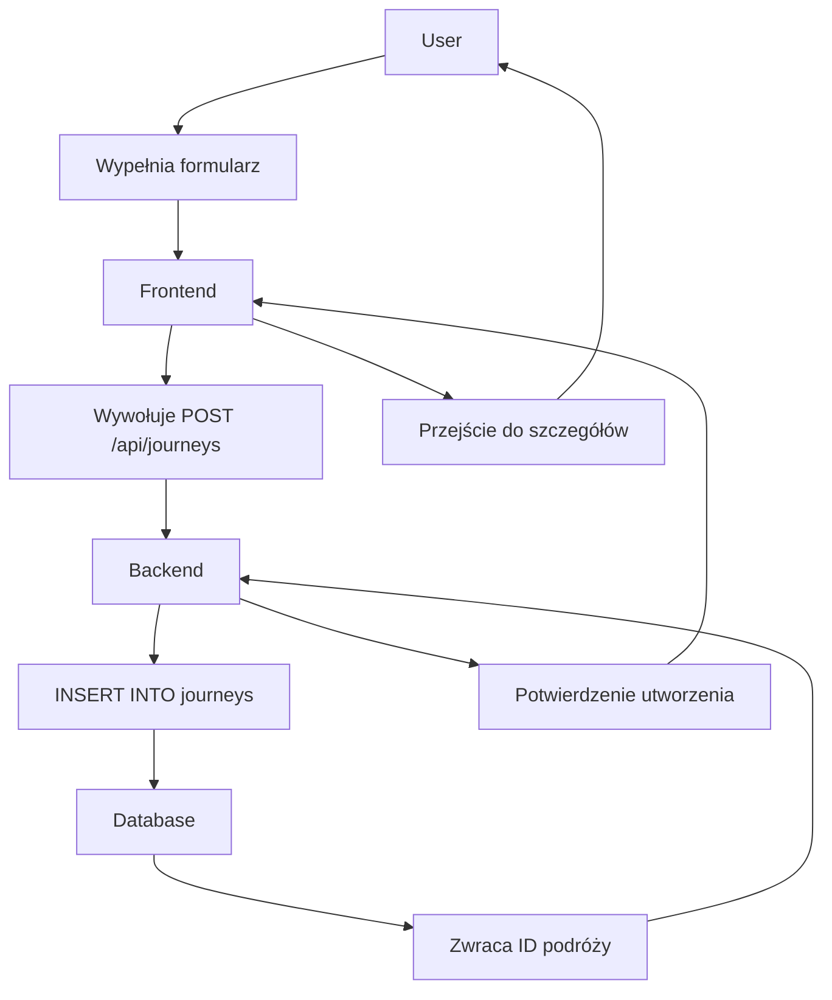

### Dodawanie Przystanku z Mapy

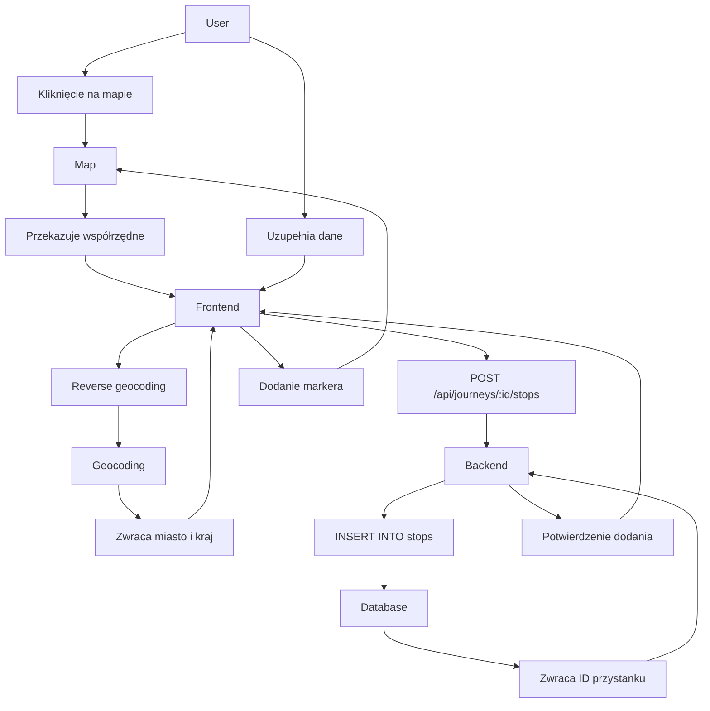

### Kalkulacja Kosztów Podróży

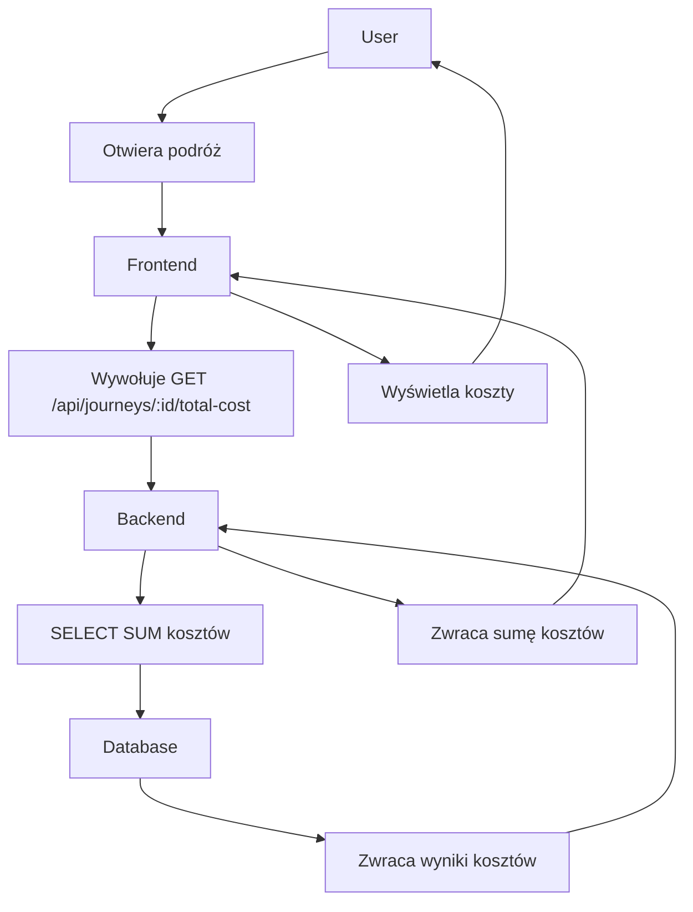

## Normalizacja Bazy Danych

Baza danych jest w **3NF (Third Normal Form)**:

✅ **1NF** - Wszystkie atrybuty są atomowe (brak powtarzających się grup)
✅ **2NF** - Wszystkie atrybuty nieprzypadkowe są w pełni zależne od klucza głównego
✅ **3NF** - Brak zależności przechodnich (każdy atrybut zależy tylko od klucza głównego)

## Rozszerzenia Bazy Danych (Przyszłość)

### Opcjonalnie: Tabela Users (dla autentykacji)

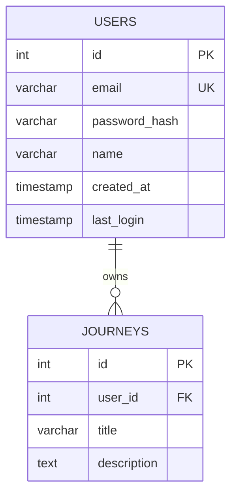

### Opcjonalnie: Tabela Photos (zdjęcia z podróży)

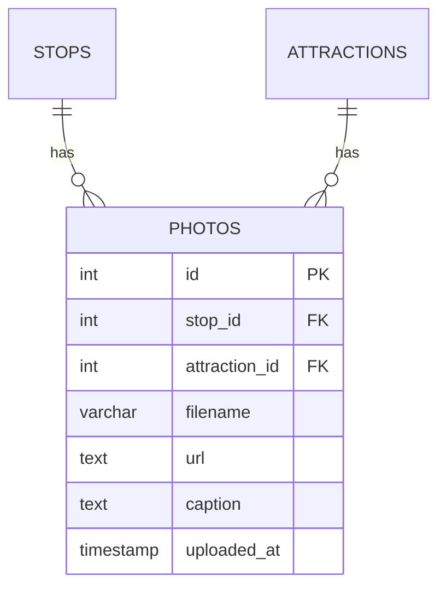
