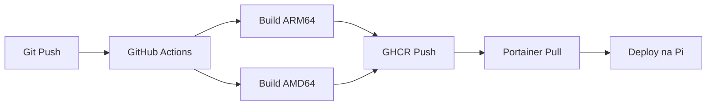

# 📦 GitHub Container Registry (GHCR) - Dokumentacja CI/CD dla SmartHome

## 📋 Spis treści
1. [Przegląd architektury](#przegląd-architektury)
2. [Dane logowania do GHCR](#dane-logowania-do-ghcr)
3. [Proces budowy obrazów](#proces-budowy-obrazów)
4. [Struktura Dockerfile](#struktura-dockerfile)
5. [Deployment w Portainerze](#deployment-w-portainerze)
6. [Instrukcje dla Journey Planner](#instrukcje-dla-journey-planner)
7. [Quick reference](#quick-reference)

---

## 🏗️ Przegląd architektury

### Automatyczna budowa obrazów (GitHub Actions)

Proces budowy uruchamia się automatycznie przy każdym `push` do brancha `main`.

**Lokalizacja workflow:** `.github/workflows/docker-publish.yml`

**Trigger events:**
```yaml
on:
  push:
    branches: [ main ]
  workflow_dispatch: {}  # Można uruchomić ręcznie z GitHub UI
```

**Permissions:**
```yaml
permissions:
  contents: read
  packages: write
```

---

## 🔐 Dane logowania do GHCR

### Credentials dla SmartHome projektu

| Parametr | Wartość |
|----------|---------|
| **Registry URL** | `ghcr.io` |
| **Username** | `adasrakieta` |
| **Password (GitHub Actions)** | `${{ secrets.GITHUB_TOKEN }}` (automatyczny) |
| **Password (ręczne)** | Personal Access Token (PAT) - zobacz niżej |
| **Image Path - App** | `ghcr.io/adasrakieta/site_proj/smarthome_app` |
| **Image Path - Nginx** | `ghcr.io/adasrakieta/site_proj/smarthome_nginx` |

### Generowanie Personal Access Token (PAT)

Jeśli potrzebujesz ręcznie logować się do GHCR (np. lokalnie):

1. **Przejdź do GitHub:**
   ```
   Settings → Developer settings → Personal access tokens → Tokens (classic)
   ```

2. **Kliknij "Generate new token (classic)"**

3. **Ustaw uprawnienia:**
   - ✅ `write:packages` - publikacja obrazów
   - ✅ `read:packages` - pobieranie obrazów
   - ✅ `delete:packages` - usuwanie starych wersji (opcjonalne)

4. **Wygeneruj i skopiuj token** (zapisz w bezpiecznym miejscu!)

### Logowanie do GHCR (ręcznie)

```bash
# Zaloguj się do GHCR używając PAT
echo "YOUR_GITHUB_PAT" | docker login ghcr.io -u adasrakieta --password-stdin

# Sprawdź czy logowanie zadziałało
docker pull ghcr.io/adasrakieta/site_proj/smarthome_app:latest
```

---

## 🛠️ Proces budowy obrazów

### Pipeline steps w GitHub Actions

#### **Krok 1: Checkout kodu**
```yaml
- name: Checkout
  uses: actions/checkout@v4
```
Pobiera kod źródłowy z repozytorium.

---

#### **Krok 2: Setup multi-arch build**
```yaml
- name: Set up QEMU (for multi-arch)
  uses: docker/setup-qemu-action@v3

- name: Set up Docker Buildx
  uses: docker/setup-buildx-action@v3
```

**Dlaczego multi-arch?**
- `linux/amd64` - standardowe serwery, komputery PC
- `linux/arm64` - **Raspberry Pi 4/5** (nasz deployment target)

---

#### **Krok 3: Automatyczne logowanie**
```yaml
- name: Log in to GHCR
  uses: docker/login-action@v3
  with:
    registry: ghcr.io
    username: ${{ github.actor }}  # = adasrakieta
    password: ${{ secrets.GITHUB_TOKEN }}  # Automatyczny token
```

**`GITHUB_TOKEN`:**
- ✅ Automatycznie generowany przez GitHub Actions
- ✅ Nie musisz go tworzyć ani przechowywać
- ✅ Ważny tylko podczas workflow
- ✅ Ma uprawnienia `packages: write` dzięki `permissions:` w workflow

---

#### **Krok 4: Generowanie tagów i metadanych**

**Dla obrazu aplikacji (Flask):**
```yaml
- name: Extract metadata (app)
  id: meta_app
  uses: docker/metadata-action@v5
  with:
    images: ghcr.io/adasrakieta/site_proj/smarthome_app
    tags: |
      type=raw,value=latest          # Tag: latest
      type=sha                        # Tag: sha-a1b2c3d (commit SHA)
```

**Dla obrazu nginx:**
```yaml
- name: Extract metadata (nginx)
  id: meta_nginx
  uses: docker/metadata-action@v5
  with:
    images: ghcr.io/adasrakieta/site_proj/smarthome_nginx
    tags: |
      type=raw,value=latest
      type=sha
```

**Rezultat:** Każdy build tworzy **2 tagi**:
- ✅ `latest` - zawsze wskazuje najnowszą wersję
- ✅ `sha-<commit_hash>` - konkretna wersja powiązana z commitem Git

**Przykład:**
```
ghcr.io/adasrakieta/site_proj/smarthome_app:latest
ghcr.io/adasrakieta/site_proj/smarthome_app:sha-a1b2c3d4e5f6
```

---

#### **Krok 5: Budowa i publikacja obrazu aplikacji**

```yaml
- name: Build and push app image
  uses: docker/build-push-action@v6
  with:
    context: .                           # Katalog źródłowy
    file: Dockerfile.app                 # Dockerfile do użycia
    push: true                           # Publikuj do registry
    platforms: linux/amd64,linux/arm64   # Multi-arch
    tags: ${{ steps.meta_app.outputs.tags }}
    labels: ${{ steps.meta_app.outputs.labels }}
    build-args: |
      ASSET_VERSION=${{ github.sha }}    # Wersja dla cache-busting
```

**Build args:**
- `ASSET_VERSION=${{ github.sha }}` - unikalny identyfikator commita (np. `a1b2c3d`)
- Używany w HTML do cache-bustingu: `<link href="style.css?v={{ asset_version }}">`

---

#### **Krok 6: Budowa i publikacja obrazu nginx**

```yaml
- name: Build and push nginx image
  uses: docker/build-push-action@v6
  with:
    context: .
    file: Dockerfile.nginx
    push: true
    platforms: linux/amd64,linux/arm64
    tags: ${{ steps.meta_nginx.outputs.tags }}
    labels: ${{ steps.meta_nginx.outputs.labels }}
```

---

## 📦 Struktura Dockerfile

### Dockerfile.app (Flask Application)

```dockerfile
FROM python:3.11-slim

# Accept build argument for asset versioning
ARG ASSET_VERSION=dev
ENV ASSET_VERSION=${ASSET_VERSION}

# Use /srv as project root to avoid accidental volume overwrite of entrypoint
WORKDIR /srv

ENV PYTHONUNBUFFERED=1 \
    PIP_NO_CACHE_DIR=1

# System packages needed (psycopg2, building wheels etc.)
RUN apt-get update && apt-get install -y --no-install-recommends \
    build-essential gcc libpq-dev curl \
  && rm -rf /var/lib/apt/lists/*

# Copy only requirements first to leverage Docker cache
COPY requirements.txt /srv/requirements.txt

RUN pip install --upgrade pip \
 && if [ -f /srv/requirements.txt ]; then pip install -r /srv/requirements.txt; fi

# Copy application code into image
COPY app/ /srv/app/
COPY utils/ /srv/utils/
COPY backups/ /srv/backups/
COPY templates/ /srv/templates/
COPY static/ /srv/static/
COPY app_db.py /srv/app_db.py

EXPOSE 5000

# Run the main entrypoint
CMD ["python", "/srv/app_db.py"]
```

**Kluczowe elementy:**
- ✅ `ARG ASSET_VERSION` - przyjmuje wersję z GitHub Actions
- ✅ Multi-stage caching - `requirements.txt` kopiowane osobno
- ✅ `PYTHONUNBUFFERED=1` - natychmiastowe logi w Docker
- ✅ `libpq-dev` - wymagane dla psycopg2 (PostgreSQL)

---

### Dockerfile.nginx (Reverse Proxy)

```dockerfile
FROM nginx:alpine

# Kopiujemy konfigurację nginx
COPY nginx/default.conf /etc/nginx/conf.d/default.conf

# Kopiujemy statyczne pliki (CSS, JS, ikony)
COPY static/ /srv/static/

EXPOSE 80 443
CMD ["nginx", "-g", "daemon off;"]
```

**Kluczowe elementy:**
- ✅ `nginx:alpine` - lekki obraz (~50MB vs ~150MB standardowy)
- ✅ Statyczne pliki wbudowane w obraz
- ✅ Konfiguracja nginx z multi-app routing (SmartHome + Journey Planner)

---

## 📋 Deployment w Portainerze

### docker-compose.yml - Referencja do obrazów GHCR

```yaml
version: '3.8'
services:
  app:
    image: ghcr.io/adasrakieta/site_proj/smarthome_app:${IMAGE_TAG:-latest}
    container_name: smarthome_app
    environment:
      - SERVER_HOST=${SERVER_HOST:-0.0.0.0}
      - SERVER_PORT=${SERVER_PORT:-5000}
      - IMAGE_TAG=${IMAGE_TAG:-latest}
      - DB_HOST=${DB_HOST}
      - DB_PORT=${DB_PORT:-5432}
      - DB_NAME=${DB_NAME}
      - DB_USER=${DB_USER}
      - DB_PASSWORD=${DB_PASSWORD}
      - SMTP_SERVER=${SMTP_SERVER}
      - SMTP_PORT=${SMTP_PORT:-587}
      - SMTP_USERNAME=${SMTP_USERNAME}
      - SMTP_PASSWORD=${SMTP_PASSWORD}
      - ADMIN_EMAIL=${ADMIN_EMAIL}
      - FLASK_ENV=${FLASK_ENV:-development}
      - SECRET_KEY=${SECRET_KEY}
      - REDIS_HOST=${REDIS_HOST:-smarthome_redis_standalone}
      - REDIS_PORT=${REDIS_PORT:-6379}
      - ASSET_VERSION=${ASSET_VERSION:-}
    volumes:
      - static_uploads:/srv/static/profile_pictures
    ports:
      - "5000:5000"
    restart: unless-stopped
    external_links:
      - smarthome_redis_standalone:redis

  nginx:
    image: ghcr.io/adasrakieta/site_proj/smarthome_nginx:${IMAGE_TAG:-latest}
    container_name: smarthome_nginx
    volumes:
      - static_uploads:/srv/static/profile_pictures:ro
      - /etc/ssl/tailscale:/etc/ssl/tailscale:ro
    ports:
      - "80:80"
      - "443:443"
    depends_on:
      - app
    restart: unless-stopped

volumes:
  static_uploads:
```

### Zmienne środowiskowe w Portainerze

**Environment variables do ustawienia w Portainer GUI:**

```bash
IMAGE_TAG=latest                        # lub sha-a1b2c3d dla konkretnej wersji
ASSET_VERSION=                          # Automatycznie z obrazu Docker

# Database (PostgreSQL)
DB_HOST=100.103.184.90
DB_PORT=5432
DB_NAME=smarthome_multihouse
DB_USER=admin
DB_PASSWORD=<secure_password>

# Flask
SECRET_KEY=<long_random_string_min_32_chars>
FLASK_ENV=production

# SMTP (email notifications)
SMTP_SERVER=smtp.gmail.com
SMTP_PORT=587
SMTP_USERNAME=your_email@gmail.com
SMTP_PASSWORD=<app_password>
ADMIN_EMAIL=admin@yourdomain.com

# Redis
REDIS_HOST=smarthome_redis_standalone
REDIS_PORT=6379
```

---

### Metody deployment w Portainerze

#### **Metoda 1: Force Recreate (Zalecane)**

1. **Wejdź do Portainer** → Stacks → `smarthome`
2. **Kliknij "Editor"**
3. **Scroll na dół**
4. **Zaznacz opcje:**
   - ✅ **Re-pull images** - pobierze najnowszy obraz z GHCR
   - ✅ **Force recreate** - wymuś odtworzenie kontenerów
5. **Kliknij "Update the stack"**

#### **Metoda 2: Używanie konkretnego SHA (Najbezpieczniejsze)**

1. **Sprawdź ostatni commit SHA w GitHub:**
   ```
   https://github.com/AdasRakieta/Site_proj/commits/main
   ```
   Przykład SHA: `a1b2c3d4e5f6`

2. **W Portainer edytuj stack, zmień:**
   ```yaml
   services:
     app:
       image: ghcr.io/adasrakieta/site_proj/smarthome_app:sha-a1b2c3d4e5f6
     
     nginx:
       image: ghcr.io/adasrakieta/site_proj/smarthome_nginx:sha-a1b2c3d4e5f6
   ```

3. **Update stack** z opcjami:
   - ✅ Re-pull images
   - ✅ Force recreate

#### **Metoda 3: Portainer Webhooks (Automatyczne CD)**

1. **W Portainer:** Settings → Webhooks → Create Webhook
2. **Skopiuj URL webhooka**
3. **W GitHub:** Settings → Webhooks → Add webhook
   - Payload URL: `<portainer_webhook_url>`
   - Content type: `application/json`
   - Trigger: `Just the push event`
4. **Zapisz** - teraz każdy push na `main` automatycznie aktualizuje deployment

---

## 🎯 Instrukcje dla Journey Planner

### Struktura obrazów Docker dla Journey Planner

**Zalecana nazwa repozytorium:** `journey_planner` (lub `journey-planner`)

**Obrazy do utworzenia:**
```
ghcr.io/adasrakieta/journey_planner/api:latest
ghcr.io/adasrakieta/journey_planner/api:sha-<commit_hash>
```

### GitHub Actions workflow dla Journey Planner

**Utwórz plik:** `.github/workflows/docker-publish.yml`

```yaml
name: Build Journey Planner Docker Images

on:
  push:
    branches: [ main ]
  workflow_dispatch: {}

permissions:
  contents: read
  packages: write

env:
  REGISTRY: ghcr.io
  IMAGE_OWNER: adasrakieta
  REPO_NAME: journey_planner

jobs:
  build-and-push:
    runs-on: ubuntu-latest
    steps:
      - name: Checkout
        uses: actions/checkout@v4

      - name: Set up QEMU (for multi-arch)
        uses: docker/setup-qemu-action@v3

      - name: Set up Docker Buildx
        uses: docker/setup-buildx-action@v3

      - name: Log in to GHCR
        uses: docker/login-action@v3
        with:
          registry: ${{ env.REGISTRY }}
          username: ${{ github.actor }}
          password: ${{ secrets.GITHUB_TOKEN }}

      - name: Extract metadata (API)
        id: meta_api
        uses: docker/metadata-action@v5
        with:
          images: |
            ${{ env.REGISTRY }}/${{ env.IMAGE_OWNER }}/${{ env.REPO_NAME }}/api
          tags: |
            type=raw,value=latest
            type=sha

      - name: Build and push API image
        uses: docker/build-push-action@v6
        with:
          context: ./server              # Ścieżka do backendu
          file: ./server/Dockerfile       # Dockerfile dla Node.js/Express
          push: true
          platforms: linux/amd64,linux/arm64
          tags: ${{ steps.meta_api.outputs.tags }}
          labels: ${{ steps.meta_api.outputs.labels }}
          build-args: |
            NODE_ENV=production
```

### Dockerfile dla Journey Planner (Node.js/TypeScript)

**Utwórz:** `server/Dockerfile`

```dockerfile
# Multi-stage build for Node.js application
FROM node:20-alpine AS builder

WORKDIR /app

# Copy package files
COPY package*.json ./
COPY tsconfig.json ./

# Install dependencies
RUN npm ci

# Copy source code
COPY src/ ./src/

# Build TypeScript
RUN npm run build

# Production stage
FROM node:20-alpine

WORKDIR /app

# Install production dependencies only
COPY package*.json ./
RUN npm ci --only=production

# Copy built files from builder
COPY --from=builder /app/dist ./dist

# Expose port
EXPOSE 5001

# Health check
HEALTHCHECK --interval=30s --timeout=5s --start-period=10s --retries=3 \
  CMD node -e "require('http').get('http://localhost:5001/health', (r) => {process.exit(r.statusCode === 200 ? 0 : 1)})"

# Run application
CMD ["node", "dist/index.js"]
```

### docker-compose.yml dla Journey Planner w Portainerze

```yaml
version: '3.8'

services:
  journey-planner-api:
    image: ghcr.io/adasrakieta/journey_planner/api:${IMAGE_TAG:-latest}
    container_name: journey_planner_api
    restart: unless-stopped
    environment:
      - NODE_ENV=production
      - PORT=5001
      - DB_HOST=100.103.184.90
      - DB_PORT=5432
      - DB_NAME=journey_planner
      - DB_USER=journey_user
      - DB_PASSWORD=${DB_PASSWORD}
    ports:
      - "5001:5001"
    networks:
      - journey_planner_network

networks:
  journey_planner_network:
    driver: bridge
```

### Dane logowania (te same co SmartHome)

```bash
# Registry
REGISTRY=ghcr.io

# Username (GitHub account)
USERNAME=adasrakieta

# Password (automatycznie w GitHub Actions)
PASSWORD=${{ secrets.GITHUB_TOKEN }}

# Personal Access Token (dla ręcznego logowania)
# Wygeneruj w: GitHub → Settings → Developer settings → Personal access tokens
# Permissions: write:packages, read:packages
```

---

## 📊 Quick Reference

### Sprawdzanie dostępnych obrazów

```bash
# Lista tagów obrazu aplikacji
curl -s https://api.github.com/users/adasrakieta/packages/container/site_proj%2Fsmarthome_app/versions \
  | jq -r '.[].metadata.container.tags[]'

# Lista tagów obrazu nginx
curl -s https://api.github.com/users/adasrakieta/packages/container/site_proj%2Fsmarthome_nginx/versions \
  | jq -r '.[].metadata.container.tags[]'
```

### Pull obrazów lokalnie

```bash
# Pull najnowszej wersji
docker pull ghcr.io/adasrakieta/site_proj/smarthome_app:latest
docker pull ghcr.io/adasrakieta/site_proj/smarthome_nginx:latest

# Pull konkretnej wersji (SHA)
docker pull ghcr.io/adasrakieta/site_proj/smarthome_app:sha-a1b2c3d
```

### Sprawdzanie SHA ostatniego commita

```bash
# Krótki SHA (7 znaków)
git rev-parse --short HEAD

# Pełny SHA
git rev-parse HEAD
```

### Wymuś aktualizację w Portainerze (CLI)

```bash
# SSH do Raspberry Pi
ssh pi@malina.tail384b18.ts.net

# Przejdź do katalogu projektu
cd ~/Site_proj

# Pull najnowszego kodu
git pull

# Wymuś ponowne pobranie obrazów i rekompozycję
docker-compose pull
docker-compose up -d --force-recreate
```

### Debugging obrazów Docker

```bash
# Sprawdź czy obraz jest multi-arch
docker manifest inspect ghcr.io/adasrakieta/site_proj/smarthome_app:latest

# Sprawdź rozmiar obrazów
docker images | grep smarthome

# Sprawdź warstwy obrazu
docker history ghcr.io/adasrakieta/site_proj/smarthome_app:latest

# Uruchom obraz lokalnie do testów
docker run -it --rm \
  -e DB_HOST=localhost \
  -e DB_USER=admin \
  -p 5000:5000 \
  ghcr.io/adasrakieta/site_proj/smarthome_app:latest
```

### Monitorowanie buildów w GitHub

```bash
# Otwórz Actions w GitHub
https://github.com/AdasRakieta/Site_proj/actions

# Sprawdź status ostatniego workflow
gh run list --workflow=docker-publish.yml --limit 1

# Zobacz logi buildu
gh run view <run-id> --log
```

---

## 🔒 Security Best Practices

### Dla SmartHome projektu (AKTUALNIE)

✅ **Używane:**
- `GITHUB_TOKEN` automatyczny (nie trzeba tworzyć secrets)
- Multi-arch builds (ARM64 + AMD64)
- Tag `latest` + `sha-<commit>` dla wersjonowania
- Environment variables w Portainer GUI (nie w kodzie)

⚠️ **Do rozważenia:**
- Image scanning (Trivy, Snyk) w GitHub Actions
- Signed images (cosign)
- Private registry (obecnie publiczne GHCR)

### Dla Journey Planner projektu (REKOMENDACJE)

```yaml
# Dodaj scanning do workflow
- name: Scan image for vulnerabilities
  uses: aquasecurity/trivy-action@master
  with:
    image-ref: ghcr.io/adasrakieta/journey_planner/api:${{ github.sha }}
    format: 'sarif'
    output: 'trivy-results.sarif'

- name: Upload Trivy results to GitHub Security
  uses: github/codeql-action/upload-sarif@v2
  with:
    sarif_file: 'trivy-results.sarif'
```

---

## 📈 Metryki i monitoring

### Rozmiar obrazów SmartHome

```
ghcr.io/adasrakieta/site_proj/smarthome_app:latest   ~450MB
ghcr.io/adasrakieta/site_proj/smarthome_nginx:latest ~50MB
```

### Czas buildów (GitHub Actions)

- **Pierwszy build:** ~8-12 minut (brak cache)
- **Kolejne buildy:** ~3-5 minut (z cache)
- **Multi-arch (ARM64+AMD64):** +2-3 minuty

### GitHub Actions limits

- **Storage:** 500MB per package (zmniejszalne przez cleanup starych wersji)
- **Transfer:** Unlimited for public packages
- **Build minutes:** 2000/month dla darmowego konta

---

## 🎓 Podsumowanie workflow



1. **Developer pushuje kod** → `git push origin main`
2. **GitHub Actions wykrywa push** → Uruchamia workflow `.github/workflows/docker-publish.yml`
3. **Budowa multi-arch obrazów** → ARM64 (Raspberry Pi) + AMD64 (serwery)
4. **Automatyczne logowanie** → `GITHUB_TOKEN` (bez ręcznej konfiguracji)
5. **Publikacja do GHCR** → Obrazy dostępne jako `latest` + `sha-<commit>`
6. **Portainer wykrywa update** → Ręcznie lub przez webhook
7. **Pull + Force recreate** → Nowe kontenery z najnowszym kodem
8. **Cache-busting** → `ASSET_VERSION=${{ github.sha }}` w HTML

---

## 📞 Kontakt i wsparcie

**Repository:** https://github.com/AdasRakieta/Site_proj

**Issues:** https://github.com/AdasRakieta/Site_proj/issues

**Actions:** https://github.com/AdasRakieta/Site_proj/actions

**GHCR Packages:** https://github.com/AdasRakieta?tab=packages

---

**Ostatnia aktualizacja:** 2025-11-10
**Wersja dokumentu:** 1.0
**Autor:** SmartHome Team
